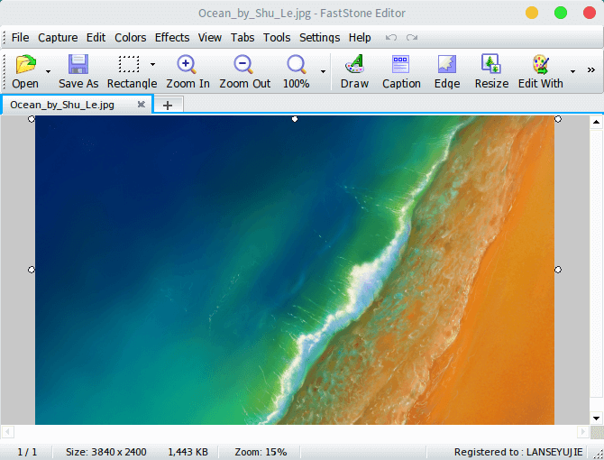

# deepin.com.fscapture

Fast Stone Capture On Deepin Wine



## About It

[[照葫芦画瓢]使用deepin-wine打包的FastStoneCapture](https://bbs.deepin.org/forum.php?mod=viewthread&tid=167195 "[照葫芦画瓢]使用deepin-wine打包的FastStoneCapture")

## How To Use

```bash
# Package
cd deepin.com.fscapture
sudo dpkg -b deepin.com.fscapture/ deepin.com.fscapture-9.0.1deepin0_i386.deb

# Install
sudo dpkg -i deepin.com.fscapture-9.0.1deepin0_i386.deb

# Uninstall
sudo dpkg -r deepin.com.fscapture
```
