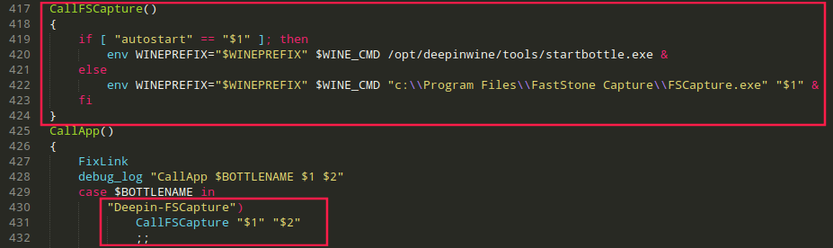

# deepin.com.fscapture

Fast Stone Capture On Deepin Wine

## About

[[照葫芦画瓢]使用deepin-wine打包的FastStoneCapture](https://bbs.deepin.org/forum.php?mod=viewthread&tid=167195 "[照葫芦画瓢]使用deepin-wine打包的FastStoneCapture")

## How To Use

```bash
# Package
cd deepin.com.fscapture
sudo dpkg -b deepin.com.fscapture/ deepin.com.fscapture-9.0.0deepin0_i386.deb

# Install
sudo dpkg -i deepin.com.fscapture-9.0.0deepin0_i386.deb

# Uninstall
sudo dpkg -r deepin.com.fscapture
```

## Issue

**Cannot be launched from the desktop entry**

Edit `/opt/deepinwine/tools/run.sh`

```shell
CallFSCapture()
{
    if [ "autostart" == "$1" ]; then
        env WINEPREFIX="$WINEPREFIX" $WINE_CMD /opt/deepinwine/tools/startbottle.exe &
    else
        env WINEPREFIX="$WINEPREFIX" $WINE_CMD "c:\\Program Files\\FastStone Capture\\FSCapture.exe" "$1" &
    fi
}

"Deepin-FSCapture")
    CallFSCapture "$1" "$2"
    ;;
```


